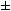

  
Consider the isosceles triangle with base length, b = 16, and legs, L = 17.
        
By using the Pythagorean theorem it can be seen that the height of the triangle, h = (172  82) = 15, which is one less than the base length.
  
With b = 272 and L = 305, we get h = 273, which is one more than the base length, and this is the second smallest isosceles triangle with the property that h = b  1.
  
Find  L for the twelve smallest isosceles triangles for which h = b  1 and b, L are positive integers.
    