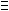

  
  For a positive number n, define C(n) as the number of the integers x, for which 1&lt;x&lt;n and  x31 mod n.  
  
  When n=91, there are 8 possible values for x, namely : 9, 16, 22, 29, 53, 74, 79, 81.   Thus, C(91)=8.
  
  Find the sum of the positive numbers n&le;1011 for which C(n)=242.  